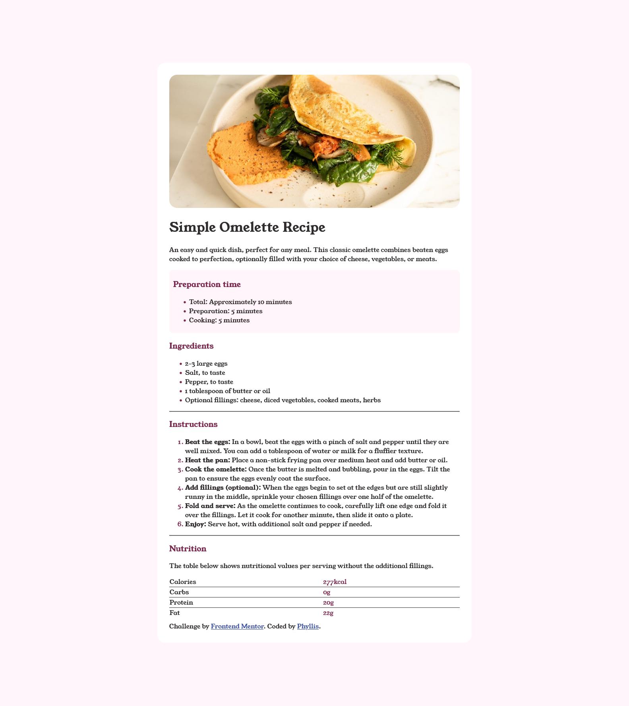

# Frontend Mentor - Recipe page solution

This is a solution to the [Recipe page challenge on Frontend Mentor](https://www.frontendmentor.io/challenges/recipe-page-KiTsR8QQKm). Frontend Mentor challenges help you improve your coding skills by building realistic projects. 

## Table of contents

- [Overview](#overview)
  - [The challenge](#the-challenge)
  - [Screenshot](#screenshot)
  - [Links](#links)
- [My process](#my-process)
  - [Built with](#built-with)
  - [What I learned](#what-i-learned)
  - [Continued development](#continued-development)
  - [Useful resources](#useful-resources)
- [Author](#author)
- [Acknowledgments](#acknowledgments)

## Overview

### Screenshot

### Links

- Solution URL: https://github.com/phyl/omelette-recipe
- Live Site URL: https://phyl.github.io/omelette-recipe

## My process

### Built with

- Semantic HTML5 markup
- CSS
- Git

### What I learned

It was a great moment to do a recap on my HTML and CSS skills. There are things that I just took for granted and thought I knew them, only to find myself stuck and refering to Google for answers. For example; I wasn't sure of how to clear the gap between the bottom borders in the columns of the table. Another one was the CSS pseudo classes. I loved the challenge more than listening to a tutorial where all answers are provided in case you get stuck. I had to make my hands dirty and juggle my mind in order to come up with a solution. 

### Continued development

There is more for me to learn in CSS in general.

### Useful resources

- https://stackoverflow.com/questions/10040842/add-border-bottom-to-table-row-tr - Remove a gap between the bottom borders in the table.
- https://www.w3schools.com/cssref/sel_nth-child.php - This helped me with selectors.

## Author

- Website - Phyllis - (https://www.theeaglink.com)
- Frontend Mentor - @phyl (https://www.frontendmentor.io/profile/phyl)
- Twitter - @eaglink (https://twitter.com/eaglink)